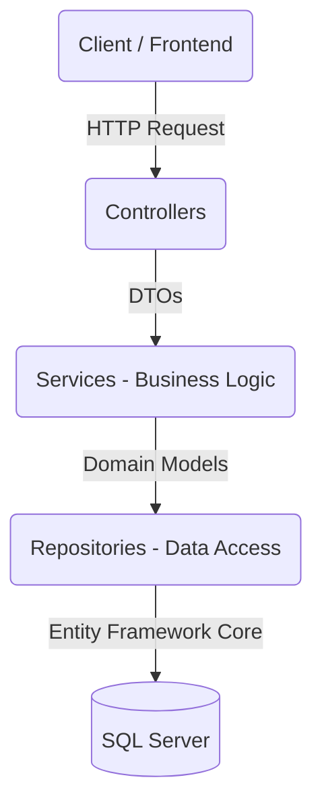
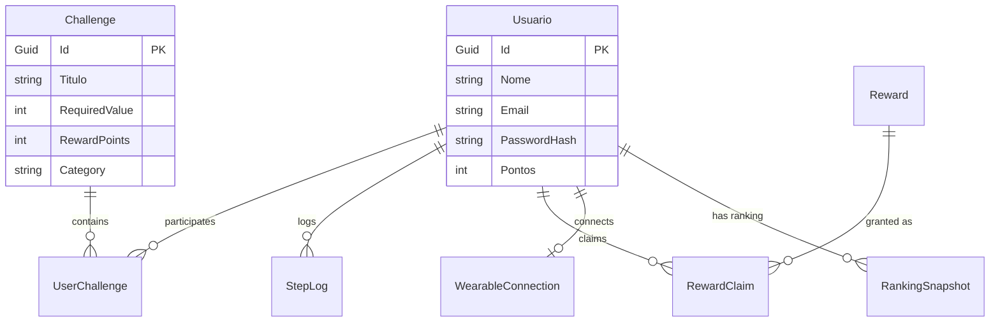

# CarePlus API - Corporate Health Gamification

Bem-vindo ao projeto CarePlusApi! Esta é a API principal de um ecossistema que promove a saúde através de desafios gamificados e recompensas para funcionários e dependentes.

### Team
|Name|RM|
|:-:|:-:|
|Diogo Julio|553837|
|Jonata Rafael|552939|
|Matheus Zottis|94119|
|Victor Didoff|552965|
|Vinicius da Silva|553240|


## 📝 About the Project
[](https://dotnet.microsoft.com/)
[](LICENSE)
[](https://github.com/SgT01/Challeng-Csharp/actions)
[](http://swagger.io/)

A robust, secure, and scalable RESTful API designed to power a corporate wellness and health gamification ecosystem. This platform engages employees by tracking physical activities, offering challenges, and rewarding healthy habits.

## 📋 Table of Contents
- [Features](#-features)
- [Architecture & Patterns](#-architecture--patterns)
- [Entity-Relationship Model](#-entity-relationship-model)
- [Tech Stack](#-tech-stack)
- [Prerequisites](#-prerequisites)
- [Getting Started](#-getting-started)
- [Testing](#-testing)
- [CI/CD](#-cicd)
- [Authentication](#-authentication)
- [Folder Structure](#-folder-structure)

## ✨ Features
- **User Management**: Secure registration and authentication using JWT & BCrypt.
- **Challenges**: Create, track, and complete fitness and wellness challenges.
- **Gamification**: Accumulate points, climb the ranking ladder, and earn rewards.
- **Wearable Integration**: Foundation for synchronizing steps with wearable devices.
- **Resilience**: Comprehensive global exception handling to protect data integrity.

## 🏛️ Architecture & Patterns

The project follows a **Clean Architecture** approach tailored for .NET 8, implementing the following design patterns:
- **Repository Pattern**: Abstraction of data access logic.
- **Service Layer Pattern**: Isolation of business rules and use cases.
- **Dependency Injection (DI)**: Extensively used to maintain low coupling.
- **DTOs & Data Annotations**: Ensuring proper data transfer and validation.



## 🗄️ Entity-Relationship Model (ERM)



## 🚀 Tech Stack

- **Framework:** .NET 8.0 ASP.NET Core
- **Database:** SQL Server
- **ORM:** Entity Framework Core 8.0 (Code-First with Migrations)
- **Security:** JWT (JSON Web Tokens), BCrypt.Net-Next
- **Mapping:** AutoMapper
- **Testing:** xUnit, Moq, FluentAssertions
- **API Documentation:** Swashbuckle.AspNetCore (Swagger)
- **Containerization:** Docker & Docker Compose

## 🔧 Prerequisites

Before you begin, ensure you have the following installed:
- [.NET 8.0 SDK](https://dotnet.microsoft.com/download/dotnet/8.0)
- [Docker](https://www.docker.com/products/docker-desktop) and Docker Compose
- [Visual Studio 2022](https://visualstudio.microsoft.com/) or [VS Code](https://code.visualstudio.com/)

## 🏃 Getting Started

### 1. Start the Environment (Docker)
The easiest way to get the database and API running is through Docker Compose.
```bash
docker-compose up -d --build
```
*This command provisions the SQL Server container, applies EF Core migrations automatically, and starts the API on port 8080.*

### 2. Manual Setup (Without Docker Compose)
If you prefer running the API locally via CLI:
```bash
# Start only the SQL Server
docker-compose up -d sqlserver

# Run the API locally
dotnet build
dotnet run
```

### 3. API Documentation
Once running, navigate to the Swagger UI to explore and test the endpoints:
- **Local:** `http://localhost:8080/swagger`

## 🧪 Testing

The solution includes an independent test project (`CarePlusApi.Tests`) ensuring high reliability for core business logic.

```bash
# Run all unit tests
dotnet test --verbosity normal
```

## 🔄 CI/CD 

This project is configured with GitHub Actions. The pipeline `.github/workflows/ci.yml` is triggered on every push or pull request to the `main` branch, ensuring that:
1. The code builds successfully.
2. All unit tests pass.

## 🔐 Authentication

Most endpoints are secured. To interact with them:
1. **Register**: `POST /api/usuarios/registrar`
2. **Login**: `POST /api/usuarios/login` (Returns a `token`)
3. **Authorize**: Click the "Authorize" button in Swagger and paste: `Bearer {your_token_here}`.

## 📂 Folder Structure

```text
CarePlusApi/
├── Controllers/       # HTTP Request Handlers (Endpoints)
├── DTOs/              # Data Transfer Objects & Validation
├── Models/            # Domain Entities (Code-First)
├── Interfaces/        # Contracts for Services and Repositories
├── Services/          # Business Rules & Use Cases
├── Data/
│   ├── Repositories/  # Data Access Implementation
│   └── AppDbContext.cs# EF Core Database Context
├── Exceptions/        # Custom Domain Exceptions
├── Extensions/        # Middleware and Startup Extensions
├── CarePlusApi.Tests/ # xUnit Test Project
└── docker-compose.yml # Container Orchestration
```

---
*Built with ❤️ for a healthier corporate environment.*
