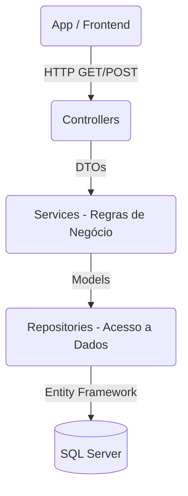
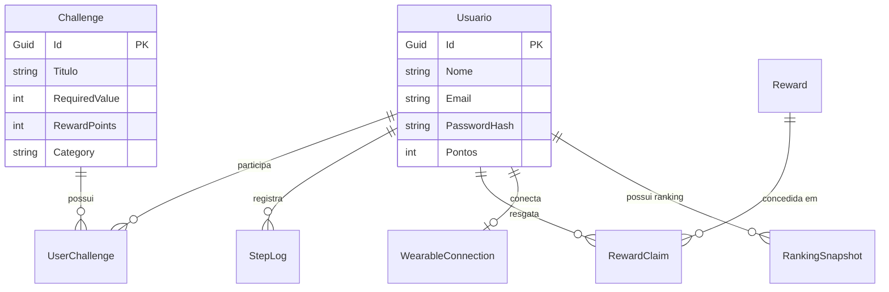

# CarePlusApi - Gamificação em Saúde Corporal Corporativa

Bem-vindo ao projeto CarePlusApi! Esta é a API principal de um ecossistema que promove a saúde através de desafios gamificados e recompensas para funcionários.

---

## 🏗️ Arquitetura

O projeto adota Clean Architecture com a separação clássica de responsabilidades.



---

## 🗄️ Modelo de Entidade Relacionamento (MER)



---

## 🚀 Tecnologias

- **C# / .NET 8.0**
- **Entity Framework Core 8.0** (Code-First & Migrations)
- **SQL Server**
- **JWT (JSON Web Token)**
- **BCrypt.Net-Next** (Criptografia)
- **AutoMapper**
- **xUnit, Moq, FluentAssertions** (Testes)
- **Swashbuckle / Swagger** (Documentação OpenAPI)

---

## ⚙️ Como rodar o projeto localmente

1. **Subir o banco de dados (Docker)**
   Na raiz do projeto, execute o docker-compose para provisionar o SQL Server:
   ```bash
   docker-compose up -d
   ```

2. **Aplicar Migrations (Opcional se já estiver configurado)**
   O projeto já contém o comando de Apply no `Program.cs` (`db.Database.EnsureCreated()`), mas se você quiser forçar as migrations:
   ```bash
   dotnet ef database update
   ```

3. **Rodar a aplicação**
   ```bash
   dotnet run
   ```

4. **Acessar o Swagger**
   Navegue até: `http://localhost:8080/swagger` ou a porta designada no seu terminal. Lá você encontrará a lista interativa de endpoints, podendo se autenticar informando o token `Bearer <seu_token>` no cadeado.

---

## 🧪 Como rodar os Testes Automatizados

O sistema conta com testes automatizados isolados.

```bash
dotnet test
```

Os testes estão no projeto `CarePlusApi.Tests` e são executados automaticamente através da pipeline no GitHub Actions (`.github/workflows/ci.yml`) a cada commit na `main`.

---

## 🔐 Autenticação (JWT)

A maioria dos endpoints requer que o usuário esteja autenticado.
1. Crie uma conta usando o endpoint `POST /api/usuarios/registrar`.
2. Faça o login em `POST /api/usuarios/login` para receber um **Token**.
3. Envie esse Token no Header das próximas requisições: `Authorization: Bearer SEU_TOKEN_AQUI`.
